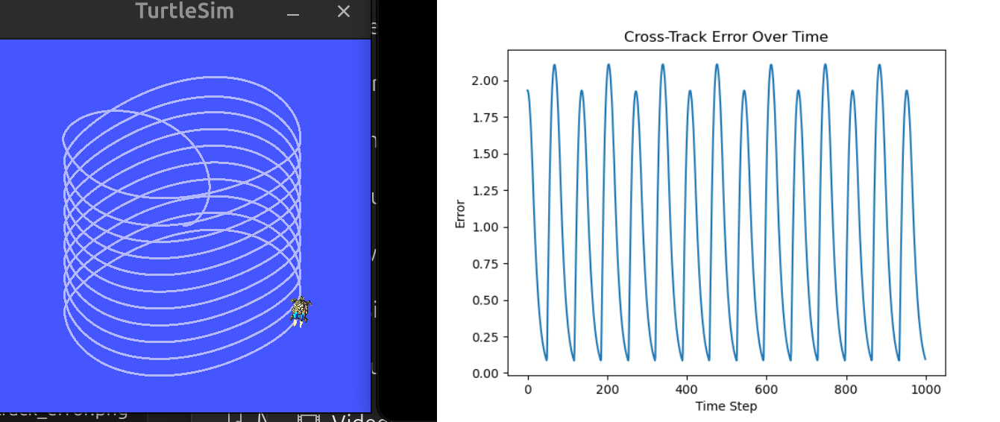
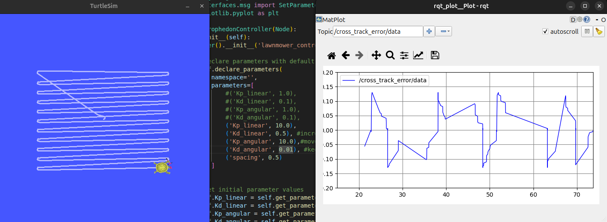
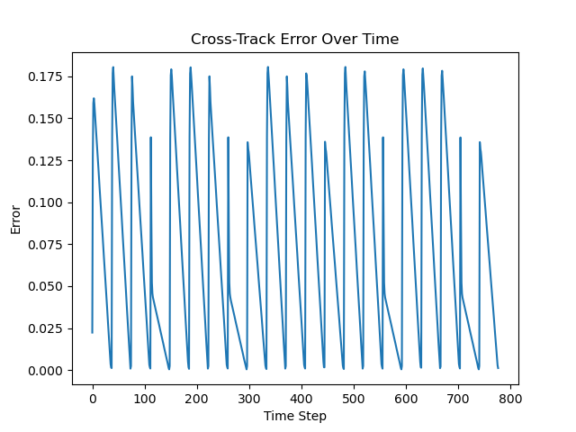
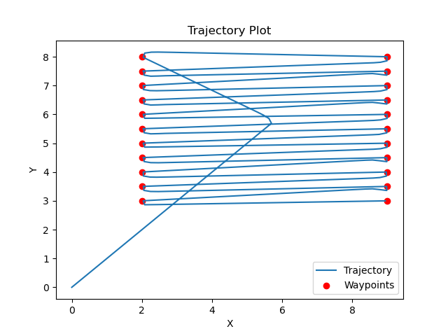
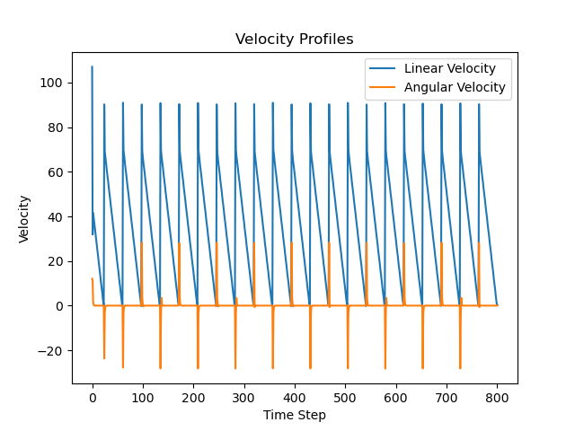
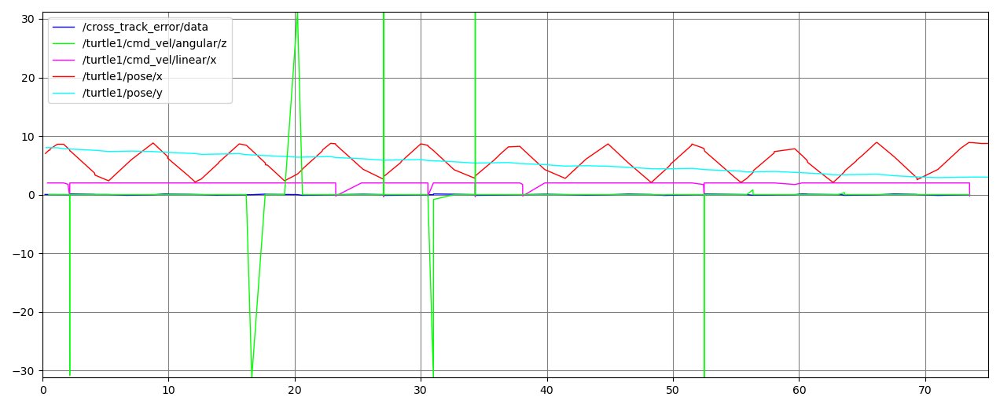
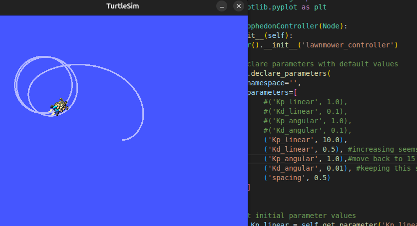

# SES598 HW1: First-Order Boustrophedon Navigator

In this assignment, the goal is to understand the provided code in ROS2 with Turtlesim, and tune the navigator to implement a precise lawnmower survey (a boustrophedon pattern). The current code will do a lawmower pattern, which is not a uniform lawnmower survey. The goal is to determined the gains for the controller that produces an optimized lawnmower survey with minimal cross track error [1].


## Background [1]
Boustrophedon patterns (from Greek: "ox-turning", like an ox drawing a plow) are fundamental coverage survey trajectories useful in space exploration and Earth observation. These patterns are useful for:

- **Space Exploration**: Rovers could use boustrophedon patterns to systematically survey areas of interest, ensuring complete coverage when searching for geological samples or mapping terrain. However, due to energy constraints, informative paths are usually optimized, and this results in paths that are sparser than complete coverage sampling, and may still produce high-accuracy reconstructions. 
  
- **Earth Observation**: Aerial vehicles employ these patterns for:
  - Agricultural monitoring and precision farming
  - Search and rescue operations
  - Environmental mapping and monitoring
  - Geological or archaeological surveys
  
- **Ocean Exploration**: Autonomous underwater vehicles (AUVs) use boustrophedon patterns to:
  - Map the ocean floor
  - Search for shipwrecks or aircraft debris
  - Monitor marine ecosystems
  
The efficiency and accuracy of these surveys depend heavily on the robot's ability to follow the prescribed path with minimal deviation (cross-track error). This assignment simulates these real-world challenges in a 2D environment using a first-order dynamical system (the turtlesim robot).

## Objective
Tune a PD controller to make a first-order system execute the most precise boustrophedon pattern possible. The goal is to minimize the cross-track error while maintaining smooth motion.

## The Challenge

### 1. Controller Tuning
#### 1.1 Original Tuning Paramters
The original gains provided in the controller are as shown below:

```python
# Controller parameters to tune
self.Kp_linear = 1.0   # Proportional gain for linear velocity
self.Kd_linear = 0.1   # Derivative gain for linear velocity
self.Kp_angular = 1.0  # Proportional gain for angular velocity
self.Kd_angular = 0.1  # Derivative gain for angular velocity
```
This results in a simulation where the robot has a high cross track error, as shown below.




#### 1.2 Pattern Parameters
**Please note** that it was decided in class the week of January 26th that this was a parameter that did not need to be tuned. Therefore, the spacing parameter is left as is at an initial value of 0.5.

```python
# Pattern parameters to tune
self.spacing = 0.5     # Spacing between lines
```

### 2. Analysis and Documentation

#### 2.1 Tuning Methodology

The controller was tuned manually through trial and error to understand the impact of each Kp_linear, Kd_linear, Kp_angular, and Kd_angular parameter. The values initially started out small and were gradually increased to understand the impact of the parameter on performance. 

It is not efficient to constantly adjust each parameter each time. It is beneficial to start with a single parameter, and then move to the subsequent parameter once it is operating good to repeat the process. The order of recommended parameter tuning: Kp_linear, Kp_angular, Kd_angular, and then Kd_angular.

WWith the provided starting values, the Kp_linear parameters is updated/increased from a value of 1.0 to 5.0. This causes the robot to go in the same repeated, tight circle. If it is too small, it will not reach a circular motion.

The next parameter to tune is the Kp_angular. Increasing this parameter forces the robot out of the repeated circle and start to follow the lawn mover, zip-zag pattern. Increasing this value with the increased Kp_linear allows the robot to track closer (reduce error) and have less overlap in the trajectory. However, as this increases it casues some additional wiggling in the cornering at the waypoints. Increasing the values of Kp_linear and Kp_angular to a value of 10.0 each will get the the cross track error around 0.2.

However, there is some overlap in the pattern at this point. It is then needed to tune Kd_linear as this will conserve some of the spacing and limit some of the overlap in the pattern. This was increased to a value of 0.5 which seems to also help conserve some of the sapcing in the corners when the turtle turns directions.

Then the final Kd_angular term is updated to reduce some of the wiggling in the cornering at the waypoints. If this value is large it will cause lots of spinning and deviation from the pattern. Adjusting this to be a smaller value reduces the wiggling within the cornering and makes the chang in direction smoother.


##### 2.1.1 Final Parameter Values and Justification
The final parameter gains provided in the controller are as shown below. The process followed aboved created a cross track less than 0.2.

```python
# Controller parameters to tune
self.Kp_linear = 10.0   # Proportional gain for linear velocity
self.Kd_linear = 0.5   # Derivative gain for linear velocity
self.Kp_angular = 10.0  # Proportional gain for angular velocity
self.Kd_angular = 0.01  # Derivative gain for angular velocity
```
The final pattern produced by the robot is shown below with the associated rqt cross track data error.




#### 2.2 Performance Plots and Metrics

##### 2.2.1 Cross-track error over time
The resulting plot for the cross track error shows the error in general reaches a maximum value of approximately 0.15.



##### 2.2.2 Trajectory plot
The trajectory plot shows the pattern the robot follows, successfully acheving a "lawn-mower" pattern.



##### 2.2.3 Velocity profiles
The robots successfull reaches each of the waypoints and smoothly corners.



##### 2.2.4 Performance metrics and analysis




#### 2.3 Challenges encountered and solutions

In general it is very time consuming to iterate the parameters manually, let the simulation run, and see what the final outcome is. It is also very difficult to tune all the parameters to get an ideal output at the same time.

It is recommended to only attempt to tune a single parameter at a time by slowly increasing or increasing the parameter to get a desired output. Specifically, it is beneficial to play around with the simulation and see which parameters have a more clean, and direct impact to being changed. These are the parameters that are easiest to start tuning and progress to the next parameters once decent performance is achieved.

The embedded rqt plotting tool stuggles to handle more than just one set of data at a time.

It is recommended to completed a simulation and open the rqt tool. The parameters of interest can be added and when restarted, usually maintains the parameters. Turning off autoscroling helps with not crashing and closing the turtle sim once all the data is recorded.

#### 2.4 Comparison of different parameter sets
A high derivative gain for angular velocity (Kd_angular) results in unstable behavior. There is a lot of twisting and oscillating.

```python
# Controller parameters to tune
self.Kp_linear = 10  # Proportional gain for linear velocity
self.Kd_linear = 0.5  # Derivative gain for linear velocity
self.Kp_angular = 10.0 # Proportional gain for angular velocity
self.Kd_angular = 0.5  # Derivative gain for angular velocity
```


A high proportional gain for linear velocity (Kp_linear) results in unstable behavior. It circles the same location repeatedly.
```python
# Controller parameters to tune
self.Kp_linear = 10  # Proportional gain for linear velocity
self.Kd_linear = 0.5  # Derivative gain for linear velocity
self.Kp_angular = 1.0 # Proportional gain for angular velocity
self.Kd_angular = 0.01  # Derivative gain for angular velocity
```



## 4 References: 
Jnaneshwar Das Arizona State University. [Course Repoository Source] (https://github.com/DREAMS-lab/ses598-space-robotics-and-ai-2026/tree/main/assignments/first_order_boustrophedon_navigator)


### 4.1 Setup Instructions

### Repository Setup
1. Fork the course repository:
   - Visit: https://github.com/DREAMS-lab/RAS-SES-598-Space-Robotics-and-AI
   - Click "Fork" in the top-right corner
   - Select your GitHub account as the destination

2. Clone your fork (outside of ros2_ws):
```bash
cd ~/
git clone https://github.com/YOUR_USERNAME/RAS-SES-598-Space-Robotics-and-AI.git
```

3. Create a symlink to the assignment in your ROS2 workspace:
```bash
cd ~/ros2_ws/src
ln -s ~/RAS-SES-598-Space-Robotics-and-AI/assignments/first_order_boustrophedon_navigator .
```

### Building and Running
1. Build the package:
```bash
cd ~/ros2_ws
colcon build --packages-select first_order_boustrophedon_navigator
source install/setup.bash
```

2. Launch the demo:
```bash
ros2 launch first_order_boustrophedon_navigator boustrophedon.launch.py
```

3. Monitor performance:
```bash
# View cross-track error as a number
ros2 topic echo /cross_track_error

# Or view detailed statistics in the launch terminal
```

4. Visualize trajectory and performance:
```bash
ros2 run rqt_plot rqt_plot
```
Add these topics:
- /turtle1/pose/x
- /turtle1/pose/y
- /turtle1/cmd_vel/linear/x
- /turtle1/cmd_vel/angular/z
- /cross_track_error


